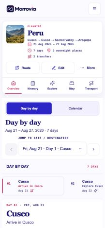
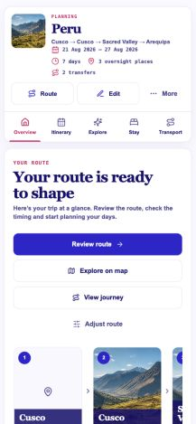
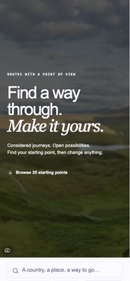
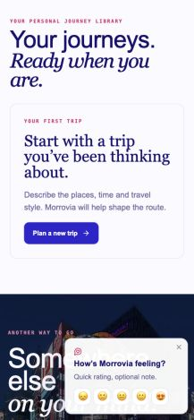
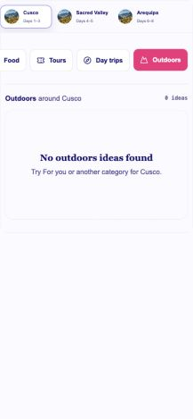
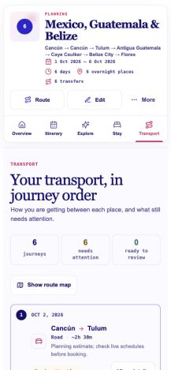
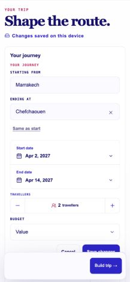
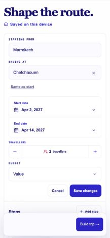

# Skim-first UX: Builder acceptance and product audit

27 September 2026 · **Founder review gate** · Local only

Base: `f6dd263550d3eccdd9bbf388423d0fa2e6882668`

Branch: `codex/skim-first-ux-audit`

Principle commit: `149be77` · Builder commit: `10c26d6`

The governing principle is [Skim-first content and hierarchy](../design-system.md#skim-first-content-and-hierarchy): **If the interface already communicates it, do not explain it again.** Use the minimum explanation required for confident use.

This branch changed only Builder presentation and the approved documentation. The separate #349 branch has since completed the compact shared mobile TripShell and simplified mobile Itinerary orientation/content hierarchy. Its work supersedes F01 and F02; neither is an implementation ticket from this audit. The screenshots here remain historical frozen-base evidence, not captures of the completed #349 result. Other findings are recommendations, not implemented changes on this branch.

## Completed or superseded by #349

| Finding | Status | Boundary |
|---|---|---|
| F01 · Shared mobile TripShell | **Completed/superseded** | #349 delivered compact shared mobile trip identity, actions and navigation. Do not rebuild it from this audit branch. |
| F02 · Mobile Itinerary orientation and empty-day hierarchy | **Completed/superseded** | #349 delivered the compact day orientation and content hierarchy while retaining canonical day navigation. Do not replay it here. |

F13 is **partially addressed**: #349 compacted the ordinary device-only mobile notice. Its separate successful account-save copy remains a lower-priority review item; it is not a reason to reopen the mobile TripShell.

## Revised Top 10 still-actionable simplifications

Ranked by exposure, mobile viewport cost, comprehension and confidence that information survives.

| Rank | Finding | Proposed simplification | Ownership / confidence |
|---|---|---|---|
| 1 | F04 · Routes | Bring search and route choices into the initial mobile view. | High exposure and viewport cost; retain editorial photography |
| 2 | F03 · Overview | Give the route actions a clear primary/secondary hierarchy. | High-frequency workspace; verify each distinct destination. Separate route warning/CTA cleanup does not settle the action hierarchy |
| 3 | F06 · Empty My Trips | Use one first-trip invitation instead of a second “another trip” campaign. | High-confidence entry-point simplification |
| 4 | F05 · My Trips | Remove the library eyebrow and shorten the repeated welcome treatment. | Broad library exposure; keep featured-current identity |
| 5 | F08 · Transport | Compress the heading, introduction and summary strip. | Bring the first journey into view sooner; retain booking/estimate distinctions |
| 6 | F07 · Explore empty | Use one clear empty result and a useful recovery action. | High-confidence repetition; distinguish genuine empty from provider failure |
| 7 | F14 · Explore provider failure | Replace the misleading “0 ideas” result summary with an unavailable state. | Correctness and trust; preserve destination/category context |
| 8 | F18 · My Trips survey overlay | Decide when the survey may interrupt first-trip or library tasks. | High impact, **founder product decision required** before implementation |
| 9 | F26 · Transport estimate explanation | Disclose repeated estimate detail where it is needed. | Repeated-card cost; preserve uncertainty and provenance |
| 10 | F10 · Route Detail | Remove the sentence explaining “Use this route.” | Small, high-confidence copy win; preserve substantive route rationale |

F09 (Stay), F11 (Discovery), F12 (rename dialog), F13's residual account-success copy, and F15–F17 remain lower-priority candidates. F19 remains a separate taxonomy decision. F20–F25 are information to keep, not simplification tickets.

### Representative evidence

All images below were captured during this audit from local production components. Captures are scaled by the in-app browser; viewport measurements use DOM CSS pixels, not the encoded image dimensions.

| Surface | 390px evidence | What to notice / direction |
|---|---|---|
| Itinerary |  | Historical pre-#349 orientation stack. F02 is completed/superseded; do not treat this capture as the current Itinerary. |
| Overview |  | Four route-oriented actions precede the route. Clarify the primary job and demote secondary actions. |
| Routes |  | The hero occupies almost the entire viewport before search. Reduce layout cost, not legibility. |
| Empty Trips |  | A first-trip invitation is followed by an “another trip” invitation; survey overlay competes with both. |
| Explore empty |  | Selected category, category heading, zero count and empty heading repeat the same state. |
| Transport |  | Title, eyebrow, explanatory sentence and three counters precede the first journey. |

## Builder: implemented and locally accepted

### Matched comparison

Production `TripBuilder` in `Builder review / Populated handoff`; Morocco route, Marrakech → Fes → Chefchaouen; 2–14 April 2027; two travellers; Value budget; 4/4/4 nights; same device-only state; scroll position 0. No data/model changes were used to improve the comparison.

| Before, 390 × 844 | After, 390 × 844 |
|---|---|
|  |  |

[Desktop before](skim-first-ux-audit/builder-before-1440-viewport.jpg) · [Desktop after](skim-first-ux-audit/builder-after-1440-viewport.jpg)

| Measurement | Before | After |
|---|---:|---:|
| Redundant visible labels: YOUR TRIP, Your journey, YOUR JOURNEY, PREFERENCES, ROUTE PLAN | 5 | 0 |
| Title/journey orientation layers above fields | 4 | 1 |
| Route heading/status layers | 3 | 1 |
| Persistent save-status lines on mobile | 1 | 1, shorter |
| Separate save-status row on desktop | 1 | 0, beside title |
| Route rows top, 390 × 844 | y=1512 | y=1064, **448px earlier** |
| Build trip top, 390 × 844 | y=771 | y=771, existing sticky action |
| Route rows top, 1440 × 844 | y=717 | y=564, **153px earlier** |
| Build trip top, 1440 × 844 | y=1269 | y=1117 |

The route list still begins below the initial mobile viewport. The improvement does not depend on clipping fields or reducing targets. Larger route-row targets and readable names can increase total page height. This is not a universal density score.

### Decisions made

- **Removed:** the five labels listed above; redundant “Describe your trip” heading above the already-labelled capture control in empty Builder.
- **Merged:** “ROUTE PLAN / Your route / 12 total · All allocated” becomes “12 nights · All allocated,” with the existing status announcement and accessible route heading retained. These are canonical **nights**, not screenshot-inspired “days.” Incomplete allocation remains explicit and warning-coloured.
- **Compressed:** “Changes saved on this device” → “Saved on this device”; equivalent Spanish copy. Desktop aligns routine status with the title. Mobile keeps it legible below the title.
- **Retained:** preference chips, including captured duration and interests, because these represent captured intent. Removing their label does not delete preferences. The dates and nights describe different facts. No silent reconciliation of an inconsistent brief was introduced.
- **Retained:** Starting from, Ending at, Same as start, date labels, travellers, budget, Save changes, field errors and genuine place/base clarification. These distinguish controls or resolve real ambiguity.
- **Retained:** transfer mode, duration, estimate/unknown state, “No arrival transfer,” usable-time uncertainty, Route Check/readiness, allocation conflict and Build trip blocking. None became a false success state.
- **Rebalanced:** on mobile the editable route rows precede the existing map. The map, map disclosure and credits remain available.
- **Fixed during acceptance:** at 390px the old overflow control overlapped the add-night target. Route identity now has its own row, and grip, night buttons and overflow target are 44px. Menu and night target rectangles no longer intersect. Long names wrap. Desktop route-row geometry is unchanged.

### Reuse and ownership

Reused `TripBuilderDetailsEditor`, `JourneyEndpointsEditor` (its existing `showHeading` option), `MorroviaDatePicker`, `MorroviaQuantitySelector`, `EasyTButton`, `EasyTSelect`, `MorroviaSaveStatus`, `TripBuilderRouteWorkspace`, route menus/reorder hook and existing map. Existing CSS tokens supply warning, typography and surface treatment. No new shared primitive, dependency, persistence owner or auth/fetch path.

Production Storybook fixture was extended for Spanish and long destinations. Its current-trip pointer is restored after use so an empty fixture cannot accidentally resume another test draft. Surrounding legacy Builder mock stories were not used as implementation proof.

### Responsive and interaction evidence

| Width × 844 | Route rows y | Build trip y | Page overflow |
|---|---:|---:|---|
| 390 | 1064 | 771, sticky | None |
| 430 | 1068 | 771, sticky | None |
| 768 | 837 | 1526 | None |
| 1024 | 547 | 1241 | None |
| 1440 | 564 | 1117 | None |

[390](skim-first-ux-audit/builder-after-390-viewport.jpg) · [430](skim-first-ux-audit/builder-after-430-viewport.jpg) · [768](skim-first-ux-audit/builder-after-768-viewport.jpg) · [1024](skim-first-ux-audit/builder-after-1024-viewport.jpg) · [1440](skim-first-ux-audit/builder-after-1440-viewport.jpg) · [Raw measurements](skim-first-ux-audit/builder-after-measurements.json)

Browser checks completed with production components:

- Normal device-only route; all endpoint/date/traveller/budget/save controls remain named and reachable.
- Changed budget and used Save changes; existing saving → device-saved status observed.
- Added a night: 13 of 12 allocated, explicit conflict alert and disabled Build trip. Restored allocation.
- Opened the Fes menu with Enter and moved it Later; visible order became Marrakech → Chefchaouen → Fes.
- Verified add-night and overflow separation, each approximately 44 × 44 CSS pixels (fractional browser rounding).
- Incomplete Thailand route retained place selection, clear pending intent and blocked completion; empty entry retained capture, first-place search and import.
- Mexico/Guatemala fixture exercised long destination names and unknown transport. Spanish fixture exercised translated controls and consolidated allocation status; no page overflow. Existing English transfer-row strings and “13 days” chip remain a localization limitation.

Authenticated cloud-saved Builder was unavailable in the isolated no-credentials environment. No cloud save was attempted. Pointer/mouse drag and browser reload recovery were not rerun end-to-end; focused route/persistence tests cover the underlying unchanged owners. This does not claim a full accessibility, zoom or screen-reader audit. Tablet/desktop compact route controls retain their pre-existing sizes; the 44px adjustment is scoped to the mobile layout.

### Verification

- Focused Builder/order/readiness/persistence/recovery/endpoints/night-allocation command: **202 tests; 178 passed, 24 browser-gated skipped, 0 failed**.
- `npm run typecheck`: passed.
- `npm run audit:ui`: passed with existing accepted debt; no baseline/allowance changes.
- `npm run build:check`: passed locally.
- `npm run build-storybook`: passed locally.
- `git diff --check`: passed.
- No dependency installation, push, deployment or CI invocation.

The focused command was:

```sh
node --experimental-strip-types --test \
  tests/trip-builder-layout.test.ts tests/trip-builder-order.test.ts \
  tests/trip-builder-route-check-presentation.test.ts \
  tests/builder-persistence-acceptance.test.ts tests/trip-browser-storage.test.ts \
  tests/trip-sync-recovery.test.ts tests/trip-builder-gate.test.ts \
  tests/journey-endpoints.test.ts tests/night-allocation.test.ts
```

Existing source assertions initially caught a lost allocation-status contract during composition; status and icon semantics were restored, without changing the tests. Browser acceptance recorded redundant labels and intersecting controls before the fixes, then their absence/separation afterwards. No new source-text tests were added for copy-only deletions.

## Audit coverage and method

1. Inspect production component and fixture provenance.
2. Open the representative local state at 390 × 844 first; inspect and save its screenshot and DOM.
3. Inspect the matching desktop state at 1440 × 844.
4. Exercise relevant disclosure/navigation without submitting external actions.
5. Rank findings by traveller impact and preserve critical information.

Storybook base: `http://localhost:8768/iframe.html?id=…&viewMode=story`. Production app auth entry: `http://localhost:3003/journey/login`. Storybook data/provider seams are fixtures, not proof of live inventory or bookings.

| Evidence prefix | Surface / Storybook suffix | Coverage and limits |
|---|---|---|
| 01 | `morrovia-05-product-patterns-homepage-dual-entry--full-composition` | Production homepage, mobile/desktop; hero and entry hierarchy |
| 02 | Same story, navigation → How it works | Production tour step 1, mobile/desktop; later steps not exhaustively reviewed |
| 03 | `morrovia-05-product-patterns-routes-discovery--default` | Production Routes, hero and catalogue structure |
| 04 | `morrovia-05-product-patterns-routes-route-detail--standard-andean` | Production Route Detail, representative reviewed route |
| 05 | Local app `/journey/login` | Auth-unconfigured state only; live login/signup/reset not tested |
| 06, 18 | `morrovia-05-product-patterns-trips-dashboard--active-trips` / `--zero-trips` | Production dashboard, featured and empty states; feedback overlay observed |
| 07 | `morrovia-05-product-patterns-trip-workspace-overview--active-planning` | Production Overview and shell; representative route/health context |
| 08 | `morrovia-05-product-patterns-trip-workspace-itinerary--default` | Frozen-base shell/day view only; #349 explicitly excluded |
| 09, 20, 24 | `morrovia-05-product-patterns-trip-workspace-explore--default-explore` / Outdoors selected / `--blocking-provider-failure` | Production Explore, populated/empty/unavailable distinguished |
| 10 | `morrovia-05-product-patterns-trip-workspace-stay--tokyo-three-night-stay` | Production Stay, fixture inventory/availability, repeated-stop navigation |
| 11 | `morrovia-05-product-patterns-trip-workspace-transport--canonical-agenda` | Production Transport, estimates/unknown/booked distinctions |
| — | `morrovia-05-product-patterns-trip-workspace-map--active-planning` | Map controls and pane inspected; tiles unstable/blank in capture. No accepted map screenshot or full map visual verdict |
| 13 | `morrovia-05-product-patterns-profile-form--default` | Session-expired boundary visible; private profile fields not available |
| 14 | `morrovia-05-product-patterns-visual-discovery--australia-places` | Production Discovery modal; fixture note excluded from findings; desktop map loading not fully reviewed |
| 15, 16, 21–23 | `morrovia-03-status-feedback-confirmation-and-recovery--current-save-failure` / `--trip-save-saved-to-account` / `--persistent-status-banners` / `--consequential-stop-removal` / `--rename-trip-unicode` | Production shared feedback/dialog components in demonstration scaffolding; only component copy assessed. No save/discard/removal submitted |
| 17 | `morrovia-03-status-feedback-loading-and-progress--homepage-long-wait` | Shared planning-progress component in demonstration scaffolding; timing/network behavior not tested |
| 25 | `morrovia-04-structure-trip-shell--genuine-historical-device-divergence` | Real shell recovery banner with fixture recovery record; placeholder workspace excluded |
| Builder | `morrovia-05-product-patterns-builder-review--populated-handoff`, `--skim-first-spanish`, `--skim-first-long-destinations`, `--direct-empty-entry`, `--builder-clarification` | Production Builder; acceptance above |

All numbered accepted evidence has `-mobile.jpg` and `-desktop.jpg` files in [the evidence directory](skim-first-ux-audit/). The failed original rename capture and unstable map captures were excluded. The later shared rename fixture provides valid visual evidence. General page-level text zoom, full keyboard traversal, all locales, authenticated account editing, live provider errors and every lifecycle variant remain outside this audit's visual coverage.

## Structural findings

### F01 · Shared TripShell / mobile identity — COMPLETED/SUPERSEDED BY #349

**Historical frozen-base state:** Planning label, image, title, route string, dates, duration, overnight-place and transfer counts, actions and workspace tabs preceded every task.

**Why:** Repeated page-wide context consumes a large share of mobile space on each workspace visit.

**Resolution:** #349 implemented the approved compact shared mobile shell, retaining identity, actions, truthful state and navigation. No further F01 implementation belongs to this audit branch.

**Risk if removed:** Loss of trip identity, meaningful logistics or save status.

**Evidence:** [08 mobile](skim-first-ux-audit/08-itinerary-mobile.jpg), [10 desktop](skim-first-ux-audit/10-stay-desktop.jpg).

### F02 · Itinerary / orientation and empty rows — COMPLETED/SUPERSEDED BY #349

**Historical frozen-base state:** Day by day toggle, Day by day heading, trip date range, Jump to date/destination label, day rail heading, selected day and four empty daypart rows.

**Why:** The same orientation is repeatedly announced before planning content.

**Resolution:** #349 implemented the approved heading, compact mobile navigation and empty-day composition while retaining the precise desktop day rail and daypart capabilities. No further F02 implementation belongs to this audit branch.

**Risk if removed:** Wrong-day edits, lost daypart access or competing selection owners.

**Evidence:** [08 mobile](skim-first-ux-audit/08-itinerary-mobile.jpg), [desktop](skim-first-ux-audit/08-itinerary-desktop.jpg).

### F03 · Overview / route action stack — REDESIGN HIERARCHY · High

**Current:** “Your route / Your route is ready to shape,” explanation, Review route, Explore on map, View journey, Adjust route, then route cards.

**Why:** Four similar action labels compete; on mobile they postpone the actual route. Their links go to different surfaces.

**Direction:** Keep one primary next action and group secondary destinations quietly. Remove the duplicate eyebrow and prose that merely describes the controls.

**Risk if removed:** Hiding map/editor access or relabelling a link without matching its destination.

**Evidence:** [07 mobile](skim-first-ux-audit/07-overview-mobile.jpg), [desktop](skim-first-ux-audit/07-overview-desktop.jpg).

### F04 · Routes / oversized entry hero — REDESIGN HIERARCHY · High

**Current:** “ROUTES WITH A POINT OF VIEW,” large headline, two supporting lines and Browse link before search/results.

**Why:** Almost the initial mobile viewport is spent introducing a catalogue the traveller came to browse.

**Direction:** Retain imagery/editorial character, but reduce hero height and bring search/first route closer. Heading-size reduction alone is insufficient.

**Risk if removed:** Loss of adventurous positioning and route discovery appeal. Founder review needed for composition.

**Evidence:** [03 mobile](skim-first-ux-audit/03-routes-mobile.jpg), [desktop](skim-first-ux-audit/03-routes-desktop.jpg).

## Quick wins: remove, merge and compress

### F05 · My Trips / library introduction — REMOVE · High

**Current:** “Your personal journey library” above “Your journeys. Ready when you are.”

**Why:** Both orient the same library; the mobile title already spans multiple lines.

**Direction:** Remove the eyebrow; consider a concise library heading while preserving the featured-current label.

**Risk if removed:** Low; preserve the page h1 and current-trip identity.

**Evidence:** [06 mobile](skim-first-ux-audit/06-trips-mobile.jpg).

### F06 · Empty My Trips / second creation invitation — MERGE · High

**Current:** “Your first trip / Start with a trip…” and Plan a new trip, followed by “Another way to go / Somewhere else on your mind?” and Start another trip.

**Why:** The second invitation assumes an existing journey and repeats the same destination/action.

**Direction:** One empty-state invitation and primary creation action; optional route inspiration as the distinct secondary action.

**Risk if removed:** Do not remove inspiration or the only create-trip path.

**Evidence:** [18 mobile](skim-first-ux-audit/18-empty-trips-mobile.jpg), [desktop](skim-first-ux-audit/18-empty-trips-desktop.jpg).

### F07 · Explore / empty category — MERGE · High

**Current:** Outdoors selected; “Outdoors around Cusco”; “0 ideas”; “No outdoors ideas found”; “Try For you or another category for Cusco.”

**Why:** Category, destination and emptiness recur across several layers.

**Direction:** Keep selected scope and one short empty statement with a direct For you action. Reduce the oversized empty panel.

**Risk if removed:** An empty category must not become indistinguishable from failed loading.

**Evidence:** [20 mobile](skim-first-ux-audit/20-explore-empty-mobile.jpg), [desktop](skim-first-ux-audit/20-explore-empty-desktop.jpg).

### F08 · Transport / introduction — COMPRESS · High

**Current:** “Transport / Your transport, in journey order” plus “How you are getting between each place, and what still needs attention” and three summary counters.

**Why:** Heading, ordered list and attention badges communicate most of this.

**Direction:** Short heading and compact attention summary. Keep specific booking and estimate states on each journey.

**Risk if removed:** Losing the number of unresolved journeys or the distinction between planned and booked.

**Evidence:** [11 mobile](skim-first-ux-audit/11-transport-mobile.jpg), [desktop](skim-first-ux-audit/11-transport-desktop.jpg).

### F09 · Stay / repeated distance sentence — COMPRESS · Medium

**Current:** “0.8 km from the centre of your mapped plans” repeated for every option.

**Why:** The reference is useful, but the sentence dominates otherwise compact metadata.

**Direction:** “0.8 km from your plan centre,” with the same calculation/reference explained in details where needed.

**Risk if removed:** Do not imply city-centre distance or walking time. Keep the qualifier.

**Evidence:** [10 mobile](skim-first-ux-audit/10-stay-mobile.jpg).

### F10 · Route Detail / CTA explanation — REMOVE · High

**Current:** Under Use this route: “Use this reviewed route as your starting point, then shape the dates and nights in Builder.”

**Why:** It restates the action; “Builder” is internal surface naming.

**Direction:** Remove this supporting sentence. Preserve reviewed route facts and editable dates/nights in the destination UI.

**Risk if removed:** Low for this line; do not remove route-specific altitude, pacing or estimate guidance.

**Evidence:** [04 mobile](skim-first-ux-audit/04-route-detail-mobile.jpg).

### F11 · Discovery / instruction above Add controls — REMOVE · Medium

**Current:** “Explore places,” country, then “Choose places to add.”

**Why:** The Add controls and shortlist already communicate the next action.

**Direction:** Remove this generic instruction; retain overnight-base versus visit-from-base distinctions and limited-coverage messaging.

**Risk if removed:** Low when Add/shortlist remain clearly labelled.

**Evidence:** [14 mobile](skim-first-ux-audit/14-discovery-mobile.jpg).

### F12 · Rename / redundant reassurance — COMPRESS · Low

**Current:** “TRIP IDENTITY,” Rename this trip, and a paragraph about personal names, geographic defaults and unchanged route/dates.

**Why:** The default-on-empty behavior is useful; the surrounding explanation is repetitive.

**Direction:** Remove the eyebrow and retain a short field hint: “Leave blank to use the destination-based name.” Keep character limit. Route through #349/shared dialog owner.

**Risk if removed:** Users may not understand blank input resets the default.

**Evidence:** [23 mobile](skim-first-ux-audit/23-rename-pattern-mobile.jpg), [desktop](skim-first-ux-audit/23-rename-pattern-desktop.jpg); same production shell dialog inspected separately.

### F13 · Routine save/promotion feedback — COMPRESS · Medium

**Current:** Device-saved heading, cross-device promotion sentence and Save this trip; successful account-save banner repeats cross-device reassurance.

**Why:** Routine reassurance competes with the task and can be confused with a recovery warning.

**Resolution / remaining direction:** #349 compacted the ordinary mobile device-only notice while preserving the save action and state rules. Only the separate successful account-save reassurance remains for possible later copy review. Do not reopen the completed mobile shell treatment or change persistence semantics.

**Risk if removed:** False cloud-save impression or loss of promotion access.

**Evidence:** [21 shared status variants](skim-first-ux-audit/21-status-banners-mobile.jpg), [16 saved state](skim-first-ux-audit/16-save-success-mobile.jpg). Demonstration components; no assumption that all banners appear together in production.

### F14 · Explore / result count during failure — MERGE · Medium

**Current:** “0 ideas” beside a provider-unavailable alert.

**Why:** Zero implies a completed empty search even when results could not load.

**Direction:** Show unavailable state in the result summary and keep one specific recovery message.

**Risk if removed:** Keep category/destination context and saved-idea safety; do not silently show empty results.

**Evidence:** [24 mobile](skim-first-ux-audit/24-provider-failure-mobile.jpg).

### F15 · Homepage / empty destination control — MERGE · Medium

**Current:** “Where do you want to go? / Add your first stop / Edit places” inside one control.

**Why:** Add and Edit describe the same empty control and create an extra reading layer.

**Direction:** One clear empty-state action label, changing appropriately once places exist. Preserve the accessible name.

**Risk if removed:** Do not obscure that multiple destinations can be added.

**Evidence:** [01 mobile](skim-first-ux-audit/01-home-mobile.jpg), [desktop](skim-first-ux-audit/01-home-desktop.jpg).

### F16 · How it works / first-step explanation — COMPRESS · Low

**Current:** “01 · Describe your trip,” “Start with the trip in your head,” screenshot of the prompt, and three clauses about places/time/preferences.

**Why:** The volunteered tour can explain the product, but the screenshot and copy overlap.

**Direction:** One short instruction about places, time and priorities; retain Next, Skip and progress.

**Risk if removed:** New visitors may need the explanation. Do not treat all marketing/onboarding copy as noise.

**Evidence:** [02 mobile](skim-first-ux-audit/02-how-it-works-mobile.jpg), [desktop](skim-first-ux-audit/02-how-it-works-desktop.jpg).

### F17 · Long-wait progress / repeated reassurance — COMPRESS · Low

**Current:** “STILL PLANNING,” current-step title, a long reassurance sentence and matching progress-step text.

**Why:** Current progress is useful; repeated stage names and “exactly as written” add little.

**Direction:** Keep the current step and delayed-state explanation; compress reassurance to the actual retained-input truth. Verify each production caller before changing shared defaults.

**Risk if removed:** A long wait must not look like a frozen or lost request. Do not claim safety beyond actual persistence.

**Evidence:** [17 mobile](skim-first-ux-audit/17-loading-mobile.jpg); shared component in demonstration scaffolding.

### F26 · Transport / repeated estimate explanation — PROGRESSIVE DISCLOSURE · Medium

**Current:** Every estimated journey repeats “Planning estimate; check live schedules before booking.”

**Why:** The full sentence repeats down the agenda; uncertainty itself is essential.

**Direction:** Keep an explicit Estimated label and approximate time on every affected row; put fuller schedule-check context in the existing selected-journey details and booking handoff.

**Risk if removed:** Never make an estimate look confirmed; ensure warning is visible before booking.

**Evidence:** [11 desktop](skim-first-ux-audit/11-transport-desktop.jpg). Preserve F21.

## Needs product decision

### F18 · My Trips / survey timing — NEEDS PRODUCT DECISION · High

**Current:** “How’s Morrovia feeling? Quick rating, optional note” overlay appears over the featured/empty library.

**Why:** Its mobile placement competes with primary content and actions. Copy shortening alone does not resolve the interruption.

**Direction:** Decide appropriate trigger/cadence and whether a quieter invitation suffices. No frequency claim is made from one fixture session.

**Risk if removed:** Reduced feedback collection; deleting the survey requires a product decision.

**Evidence:** [06 mobile](skim-first-ux-audit/06-trips-mobile.jpg), [18 mobile](skim-first-ux-audit/18-empty-trips-mobile.jpg).

### F19 · Explore / category taxonomy — NEEDS PRODUCT DECISION · Medium

**Current:** For you, Must-see, Food, Tours, Day trips, Outdoors; categories can be empty, and mobile tabs scroll horizontally.

**Why:** Tours and Day trips may overlap conceptually. Renaming/removing them changes discovery behavior, not just copy.

**Direction:** Review taxonomy alongside coverage and existing Explore work; preserve access to saved and organic ideas.

**Risk if removed:** Lost findability or misleading coverage.

**Evidence:** [09 desktop](skim-first-ux-audit/09-explore-desktop.jpg), [20 mobile](skim-first-ux-audit/20-explore-empty-mobile.jpg).

## Keep: information that earns its space

### F20 · Save/recovery / two protected copies — KEEP · Critical

**Current:** Account copy not updated; device edits safe; retry/open device copy/discard choice.

**Why:** The traveller must know where work exists and what an action will affect.

**Direction:** Keep specific state, safety and recovery action visible. Simplify terminology only without losing copy identity.

**Risk if removed:** Lost edits, false saved impression or destructive recovery choice.

**Evidence:** [15](skim-first-ux-audit/15-save-error-mobile.jpg), [25](skim-first-ux-audit/25-device-recovery-mobile.jpg).

### F21 · Transport/route / planning uncertainty — KEEP · Critical

**Current:** Approximate travel time, unknown transport and schedule-check wording.

**Why:** These facts change routing and booking decisions.

**Direction:** Preserve estimated/confirmed/unknown distinctions; F26 may change repetition only.

**Risk if removed:** Traveller treats an estimate as a confirmed journey.

**Evidence:** [11](skim-first-ux-audit/11-transport-desktop.jpg); Builder's unknown leg also retained.

### F22 · Stay/Transport / booking confidence — KEEP · High

**Current:** Availability to check, Choose stay, Booked.

**Why:** Selection, suggestion, availability and booking are different states.

**Direction:** Keep factual confidence next to each relevant option/action.

**Risk if removed:** Assuming accommodation or transport is reserved when it is not.

**Evidence:** [10](skim-first-ux-audit/10-stay-mobile.jpg), [11](skim-first-ux-audit/11-transport-desktop.jpg).

### F23 · Imagery/providers/auth / disclosure — KEEP · Critical

**Current:** Image-credit access, partner identity/commission disclosure, Terms and Privacy links.

**Why:** Source, commercial and consent boundaries are not decorative explanation.

**Direction:** Retain truthful attribution tied to the displayed asset/provider and accessible disclosure access. Consolidation needs an owner-level review.

**Risk if removed:** Misattribution, obscured commercial relationship or lost privacy information.

**Evidence:** [04](skim-first-ux-audit/04-route-detail-mobile.jpg), [09](skim-first-ux-audit/09-explore-mobile.jpg), [05](skim-first-ux-audit/05-auth-mobile.jpg).

### F24 · Destructive confirmation / concrete consequences — KEEP · Critical

**Current:** Named stop, nights/days removed, changed route leg, saved stays/notes affected, explicit keep/remove choices.

**Why:** This explanation changes the decision and prevents accidental loss.

**Direction:** Keep concrete consequences and safe initial focus. “Downstream work” could become plain traveller language, but not at the expense of meaning.

**Risk if removed:** Irreversible loss of planned work without understanding.

**Evidence:** [22 mobile](skim-first-ux-audit/22-confirmation-mobile.jpg), [desktop](skim-first-ux-audit/22-confirmation-desktop.jpg). No removal performed.

### F25 · Auth/profile / session boundary — KEEP · Critical

**Current:** “Your session ended. Your private profile is hidden until you sign in again.”

**Why:** It explains why content vanished and gives the recovery action.

**Direction:** Keep specific session/privacy truth and return-to-context sign-in. The local unconfigured-auth/prototype wording warrants review when live auth is available; it is not evidence about hosted auth.

**Risk if removed:** Confusion about lost account data or a weakened private-state boundary.

**Evidence:** [13](skim-first-ux-audit/13-profile-mobile.jpg), [05](skim-first-ux-audit/05-auth-mobile.jpg).

## Counts and proposed implementation waves

The classification counts below describe the original 26-finding inventory, including the two findings now completed by #349. Current status: **2 completed/superseded** (F01–F02); **24 open or partially addressed**, including the residual F13 account-success copy. Six of the 24 are KEEP guardrails, not implementation tasks.

| Classification | Count |
|---|---:|
| KEEP | 6 |
| REMOVE | 3 |
| COMPRESS | 6 |
| MERGE | 4 |
| PROGRESSIVE DISCLOSURE | 1 |
| REDESIGN HIERARCHY | 4 |
| NEEDS PRODUCT DECISION | 2 |
| **Total** | **26** |

1. **Completed ownership:** F01 and F02 are closed by #349. Its ordinary mobile device-only treatment addresses part of F13. F12 and F13's account-success copy require separate owner review; compare other library/Explore findings with their post-MVP branches before implementation. No duplicate implementation or cherry-pick here.
2. **Highest-value composition:** F04 and F03, then F06/F05/F08. Verify route destinations and preserve meaningful state; use matched mobile/desktop captures if a later implementation is approved.
3. **Empty, unavailable and estimate clarity:** F07/F14/F26, then smaller F10/F09/F11/F15. Keep genuine empty results distinct from provider failure and preserve estimate uncertainty.
4. **Product decisions:** F18/F19 require founder direction. F16/F17 and the residual F13 copy are lower-priority refinements.

Every wave retains F20–F25. Do not weaken existing tests or UI audit baselines. No additional product recommendation is implemented on this audit branch; F01/F02 were completed independently in #349.

## Review verdict

- **DOCUMENTATION: READY**
- **BUILDER: ACCEPTED PENDING FINAL VISUAL REVIEW**, with authenticated/browser-gated and localization limits stated above. Do not reopen without a concrete regression in the supplied screenshots.
- **PRODUCT-WIDE AUDIT: RECONCILED WITH #349**, with F01/F02 closed and the remaining findings unimplemented.

Stop here for founder review. No push, deployment, CI, staging or main changes.
